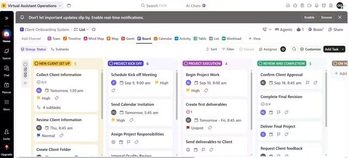
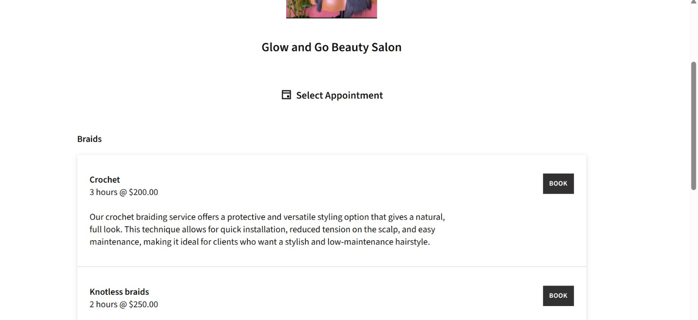
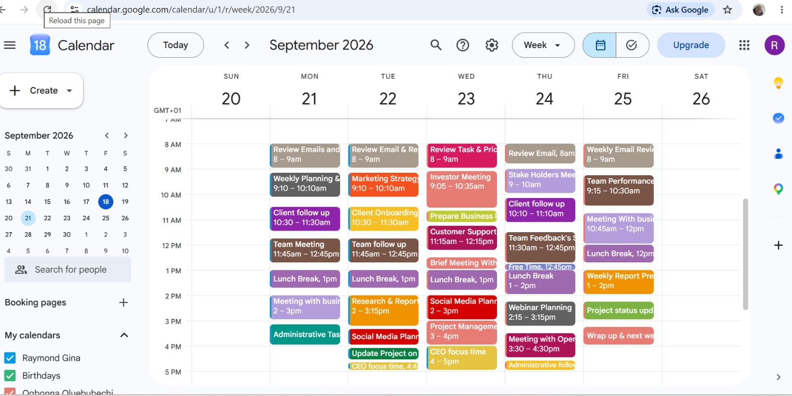

## ABOUT ME 
Hello 🤗, I'm Oluebubechi, an Executive virtual assistant who helps executives and business owners stay organized, manage priorities, and operate more efficiently. Through efficient calendar management, meeting coordination, travel planning, inbox organization, and administrative support, I create systems that streamline operations and save valuable time. My goal is to provide proactive support that keeps businesses running smoothly and allows leaders to focus on high-impact decisions.
## SKILLS 
- Administrative Support
- Calendar Management
- Data Entry
- Email Management
- Project Management
- Workflow Organisation
- Documentation
- Online Research
- Inbox Management
- Meeting Planning & Coordination
- Digital File Organization & Record Management

## TOOL STACK 
- Google Workspace
- Trello
- Clickup
- Monday.com
- Asana
- Zapier
- Canva
- Acuity Scheduling

## PORTFOLIO PROJECT 
### CEO Operations Dashboard 

 Built a Trello-based dashboard used for organizing tasks, priorities, deadlines, checklists, and team coordination
 [View Project](https://drive.google.com/file/d/1y42Ujt7K-Zg-yY0VeFsMDe-KoqkRKn-C/view?usp=drivesdk)
### Client Onboarding System

A ClickUp workflow designed to organize client Onboarding form setup through portfolio Completion. [View Project](https://drive.google.com/file/d/1sQbdoIQlJXtenzcwzOO2rXuS2MyV-5-S/view?usp=drivesdk)
### Task Management System
Created a management dashboard using Google sheets for an entrepreneur to help track Priorities, deadlines, task project and follow ups.
[View Project](https://drive.google.com/file/d/1v7N-yIBCLoBfQbBjlQUUY3QGDt3vsA80/view?usp=drivesdk)
### Team Business Travel Coordination
.jpg)
A ClickUp project for coordinating team business travel, including tasks, deadlines, dependencies, documentation, and communication. [View Project](https://drive.google.com/file/d/1kNrsPbDDNB1w641oKCpyl3L2KnaMUi7a/view?usp=drivesdk)
### Client Appointment Booking System

Built an online booking system using Acuity Scheduling to streamline appointment scheduling and improve client booking efficiency.
[View Project](https://drive.google.com/file/d/1EP2l9cdG4dbfmyYQovRjpXg1fX1XGltb/view?usp=drivesdk)
### Calendar Management & Integration

A Google Calendar project demonstrating schedule management, reminders, buffer time, and calendar integration.
### Workflow Automation using Zapier
Built automated workflow connecting Google Forms, Google Sheets, Zapier, and Trello to organize customer inquiries.
[View Project](https://drive.google.com/file/d/1Hn4dDEfaH6V_2FUXkKgdM1PeJojY42GM/view?usp=drivesdk)

## Certificate 
- In-Demand IT Skills Training
- Google Workspace Mastery Course
- Introduction to project Management with Clickup
- Get started with Asana
[Certificate](https://drive.google.com/drive/folders/1lAOxmw_KpPpQUTL0cZsaG-TmMN-kYsmZ)
## LET WORK TOGETHER 
Behind every team is an organized Executive Virtual Assistant

Your team deserve structure and a partner you can count on.
- [LinkedIn](https://www.linkedin.com/in/oluebubechi-ogbonna-b57907402?utm_source=share_via&utm_content=profile&utm_medium=member_android)
- [Facebook](https://www.facebook.com/share/1MB8LJUWjk/)
- [WhatsApp](@oluebubechimaryglory)
